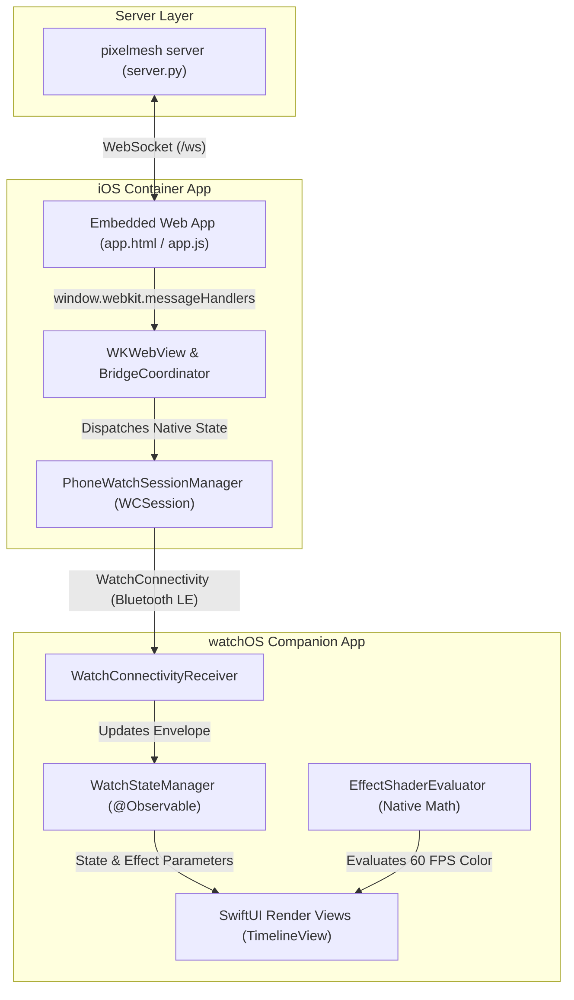
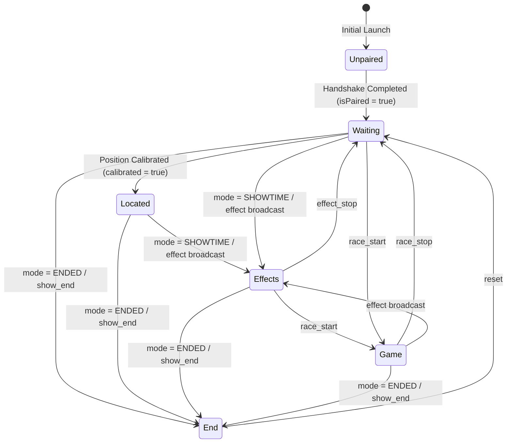

# Technical Specification: pixelmesh iOS & watchOS Companion Architecture

## 1. System Overview & Architecture

The system extends the existing **pixelmesh** audience interaction platform to Apple Watch. An iOS container app embeds the existing web app in a high-performance, hardened `WKWebView`. The web app continues to handle server communications, optical detection, and user interaction on the phone. Concurrently, it bridges state and parametric commands to native Swift on the iPhone, which relays them via `WatchConnectivity` (`WCSession`) to an independent, native watchOS companion app.



### Core Design Principles
1. **Zero Web Regressions**: The web app runs without modification to core logic; it communicates through a lightweight, injected JavaScript bridge.
2. **Parametric Forwarding (Not Pixel Streaming)**: Only state changes, calibration metrics, clock sync offsets, and mathematical effect descriptions are sent across Bluetooth. The watch renders all 60 FPS visual shaders natively.
3. **Parity Across Lifecycles**: The watch replicates each stage of the experience (`Waiting`, `Located`, `Effects`, `Game / Race`, `End / Souvenir`).
4. **Resilience by Default**: Reconnection loops, watchdog timers, state re-hydration, and screen-sleep prevention ensure uninterrupted operation during live arena events.

---

## 2. Communication Protocol & Message Schemas

### 2.1 Web $\to$ Native iOS Bridge (`WKScriptMessageHandler`)
The web layer intercepts incoming WebSocket payloads and emits them to WebKit message handlers.

```typescript
// Injected Bridge Hook (pre-app.js load via WKUserScript)
(function() {
  const origWS = window.WebSocket;
  window.WebSocket = function(...args) {
    const ws = new origWS(...args);
    ws.addEventListener('message', function(event) {
      try {
        if (window.webkit && window.webkit.messageHandlers && window.webkit.messageHandlers.pixelmeshBridge) {
          window.webkit.messageHandlers.pixelmeshBridge.postMessage(event.data);
        }
      } catch (e) {
        console.error("Bridge dispatch error", e);
      }
    });
    return ws;
  };
})();
```

### 2.2 iOS $\to$ watchOS Payloads (`WatchConnectivity`)
Messages utilize `WCSession.default.sendMessage(_:replyHandler:errorHandler:)` for real-time transitions, backed by `WCSession.default.updateApplicationContext(_:)` for state recovery when the watch app launches mid-show.

#### Payload Contract: `WatchMeshEnvelope`
```json
{
  "version": 1,
  "timestamp": 1774384920150,
  "serverTimeOffsetMs": -14.2,
  "pairing": {
    "isPaired": true,
    "deviceId": "e9b2a7c8-...",
    "blinkId": 42,
    "u": 0.4521,
    "v": 0.7812,
    "calibrated": true
  },
  "viewState": "effects",
  "activeEffect": {
    "effect": "wave",
    "startTime": 1774384918000,
    "speed": 0.4,
    "spatialFreq": 1.5,
    "bpm": 100,
    "originU": 0.5,
    "originV": 0.5,
    "colorR": 0,
    "colorG": 200,
    "colorB": 255,
    "color2R": 255,
    "color2G": 0,
    "color2B": 100
  },
  "game": {
    "active": false,
    "mode": "race",
    "myProgress": 0.0,
    "leaderProgress": 0.0,
    "rank": null,
    "winnerWho": null,
    "youWon": false
  },
  "stats": {
    "likeCount": 1420
  }
}
```

---

## 3. iOS Wrapper Implementation

### 3.1 Architecture
* **Language & Runtime**: Swift 6.0, iOS 17.0+ deployment target.
* **Component Layering**:
  * `MeshWebView`: Custom `WKWebView` wrapped in SwiftUI via `UIViewRepresentable`.
  * `BridgeCoordinator`: Conforms to `WKScriptMessageHandler` and `WKNavigationDelegate`.
  * `PhoneWatchSessionManager`: Singleton actor managing `WCSession` and state coalescing.
  * `KeepAwakeService`: Manages `UIApplication.shared.isIdleTimerDisabled`.

### 3.2 Key iOS Implementations

#### Web View Configuration & Script Injection
```swift
import SwiftUI
import WebKit

struct PixelmeshWebView: UIViewRepresentable {
    let url: URL
    let bridgeCoordinator: BridgeCoordinator

    func makeUIView(context: Context) -> WKWebView {
        let config = WKWebViewConfiguration()
        let contentController = WKUserContentController()

        // Inject hook before any web script runs
        let bridgeScript = """
        (function() {
            window.__PIXELMESH_NATIVE__ = true;
            const nativeBridge = window.webkit?.messageHandlers?.pixelmeshBridge;
            window.__notifyNative = function(payload) {
                nativeBridge?.postMessage(typeof payload === 'string' ? payload : JSON.stringify(payload));
            };
        })();
        """
        let userScript = WKUserScript(
            source: bridgeScript,
            injectionTime: .atDocumentStart,
            forMainFrameOnly: true
        )
        contentController.addUserScript(userScript)
        contentController.add(bridgeCoordinator, name: "pixelmeshBridge")
        config.userContentController = contentController

        // Performance & Media Configuration
        config.allowsInlineMediaPlayback = true
        config.mediaTypesRequiringUserActionForPlayback = []
        config.preferences.isFraudulentWebsiteWarningEnabled = false

        let webView = WKWebView(frame: .zero, configuration: config)
        webView.navigationDelegate = bridgeCoordinator
        webView.scrollView.isScrollEnabled = false
        webView.scrollView.bounces = false
        webView.isOpaque = false
        webView.backgroundColor = .black
        webView.load(URLRequest(url: url, cachePolicy: .reloadIgnoringLocalCacheData))
        return webView
    }

    func updateUIView(_ uiView: WKWebView, context: Context) {}
}
```

#### Bridge Coordinator & Watch Connectivity Relay
```swift
import Foundation
import WebKit
import WatchConnectivity

@MainActor
final class BridgeCoordinator: NSObject, WKScriptMessageHandler, WKNavigationDelegate {
    private let watchManager: PhoneWatchSessionManager

    init(watchManager: PhoneWatchSessionManager = .shared) {
        self.watchManager = watchManager
        super.init()
    }

    func userContentController(
        _ userContentController: WKUserContentController,
        didReceive message: WKScriptMessage
    ) {
        guard message.name == "pixelmeshBridge",
              let bodyString = message.body as? String,
              let data = bodyString.data(using: .utf8) else {
            return
        }

        Task {
            await watchManager.processWebEvent(data: data)
        }
    }

    func webViewWebContentProcessDidTerminate(_ webView: WKWebView) {
        // High-resilience auto-recovery if WebKit process is purged under memory pressure
        webView.reload()
    }
}

@globalActor
actor WatchSessionActor {
    static let shared = WatchSessionActor()
}

@WatchSessionActor
final class PhoneWatchSessionManager: NSObject, WCSessionDelegate {
    static let shared = PhoneWatchSessionManager()

    private var currentEnvelope = WatchMeshEnvelope.unpairedDefault
    private var session: WCSession?

    func activate() {
        guard WCSession.isSupported() else { return }
        session = WCSession.default
        session?.delegate = self
        session?.activate()
    }

    func processWebEvent(data: Data) {
        guard let json = try? JSONSerialization.jsonObject(with: data) as? [String: Any],
              let type = json["type"] as? String else {
            return
        }

        var mutated = false

        switch type {
        case "assigned":
            currentEnvelope.pairing.isPaired = true
            currentEnvelope.pairing.blinkId = json["blink_id"] as? Int
            currentEnvelope.pairing.u = json["u"] as? Double ?? 0.5
            currentEnvelope.pairing.v = json["v"] as? Double ?? 0.5
            currentEnvelope.pairing.calibrated = json["calibrated"] as? Bool ?? false
            currentEnvelope.viewState = currentEnvelope.pairing.calibrated ? .located : .waiting
            mutated = true

        case "update_position":
            currentEnvelope.pairing.u = json["u"] as? Double ?? currentEnvelope.pairing.u
            currentEnvelope.pairing.v = json["v"] as? Double ?? currentEnvelope.pairing.v
            currentEnvelope.pairing.calibrated = true
            currentEnvelope.viewState = .located
            mutated = true

        case "mode":
            if let mode = json["mode"] as? String {
                if mode == "SHOWTIME" { currentEnvelope.viewState = .effects }
                else if mode == "ENDED" { currentEnvelope.viewState = .end }
                mutated = true
            }

        case "effect":
            currentEnvelope.viewState = .effects
            currentEnvelope.activeEffect = EffectParameters(from: json)
            mutated = true

        case "effect_stop":
            currentEnvelope.activeEffect = nil
            currentEnvelope.viewState = .waiting
            mutated = true

        case "sync_pong":
            if let serverTime = json["server_time"] as? Double,
               let clientTime = json["client_time"] as? Double {
                let localNow = Date().timeIntervalSince1970 * 1000.0
                let rtt = localNow - clientTime
                let estimatedServerNow = serverTime + (rtt / 2.0)
                currentEnvelope.serverTimeOffsetMs = estimatedServerNow - localNow
                mutated = true
            }

        default:
            break
        }

        if mutated {
            dispatchToWatch()
        }
    }

    private func dispatchToWatch() {
        guard let session = session, session.activationState == .activated, session.isWatchAppInstalled else {
            return
        }

        guard let payload = try? currentEnvelope.toDictionary() else { return }

        // Send instantaneous real-time update
        session.sendMessage(payload, replyHandler: nil) { error in
            // Fallback for background or transient disconnect
            try? session.updateApplicationContext(payload)
        }
    }

    // WCSessionDelegate Stubs
    nonisolated func session(
        _ session: WCSession,
        activationDidCompleteWith activationState: WCSessionActivationState,
        error: Error?
    ) {}
    nonisolated func sessionDidBecomeInactive(_ session: WCSession) {}
    nonisolated func sessionDidDeactivate(_ session: WCSession) {
        WCSession.default.activate()
    }
}
```

---

## 4. watchOS Companion Implementation

### 4.1 Architecture
* **Framework**: watchOS 10.0+ / 11.0, SwiftUI, `@Observable` architecture (Observation framework).
* **Display Runtime Strategy**: Requires `WKExtendedRuntimeSession` (Session Type: `.smartAlarm` or `.mindfulness`) to prevent screen timeout and retain 60 FPS active state while wrist is oriented away.
* **Rendering Engine**: Native SwiftUI `TimelineView(.animation)` evaluating the parametric formulas directly against local hardware timers and server clock offsets.

### 4.2 State Machine
The watch transitions between distinct UI views matching the web app:



### 4.3 Native Effect Evaluator (Swift 6)
This mirrors `public/app.js` lines 1512–1580 with bit-accurate output parity:

```swift
import SwiftUI

struct RGBColor: Equatable, Sendable {
    let r: Double
    let g: Double
    let b: Double

    var swiftUIColor: Color {
        Color(red: r / 255.0, green: g / 255.0, blue: b / 255.0)
    }
}

struct EffectShaderEvaluator: Sendable {
    static func evaluate(
        effect: EffectParameters,
        u: Double,
        v: Double,
        nowMs: Double
    ) -> RGBColor {
        let t = max(0.0, (nowMs - effect.startTime) / 1000.0)
        let angleRad = effect.angle * .pi / 180.0
        let directedCoord = u * cos(angleRad) + v * sin(angleRad)

        switch effect.name {
        case "wave":
            let phase = 2.0 * .pi * (directedCoord * effect.spatialFreq - t * effect.speed)
            let intensity = 0.5 + 0.5 * sin(phase)
            return RGBColor(
                r: intensity * effect.colorR,
                g: intensity * effect.colorG,
                b: intensity * effect.colorB
            )

        case "gradient":
            var i = (directedCoord - t * effect.speed).truncatingRemainder(dividingBy: 1.0)
            if i < 0 { i += 1.0 }
            return RGBColor(
                r: i * effect.colorR,
                g: i * effect.colorG,
                b: i * effect.colorB
            )

        case "pulse":
            let beat = sin(2.0 * .pi * (effect.bpm / 60.0) * t)
            let intensity = max(0.0, beat)
            return RGBColor(
                r: intensity * effect.colorR,
                g: intensity * effect.colorG,
                b: intensity * effect.colorB
            )

        case "ripple":
            let du = u - effect.originU
            let dv = v - effect.originV
            let dist = sqrt(du * du + dv * dv)
            let front = t * effect.speed
            let totalWidth = 0.7
            let delta = dist - front
            var intensity = 0.0

            if delta <= 0 && delta >= -totalWidth {
                let age = -delta / totalWidth
                intensity = exp(-age * 3.0)
            }
            let falloff = exp(-dist * dist * 0.6)
            intensity *= falloff
            return RGBColor(
                r: intensity * effect.colorR,
                g: intensity * effect.colorG,
                b: intensity * effect.colorB
            )

        default:
            return RGBColor(r: 0, g: 0, b: 0)
        }
    }
}
```

### 4.4 Watch App Root & Views

```swift
import SwiftUI

@main
struct PixelmeshWatchApp: App {
    @State private var stateManager = WatchStateManager()

    var body: some Scene {
        WindowGroup {
            ContentView()
                .environment(stateManager)
                .onAppear {
                    stateManager.startSession()
                }
        }
    }
}

@Observable
final class WatchStateManager: NSObject, @unchecked Sendable {
    var envelope: WatchMeshEnvelope = .unpairedDefault
    private var extendedSession: WKExtendedRuntimeSession?

    func startSession() {
        WatchConnectivityReceiver.shared.onEnvelopeReceived = { [weak self] newEnvelope in
            Task { @MainActor in
                self?.envelope = newEnvelope
                self?.evaluateExtendedSession()
            }
        }
        WatchConnectivityReceiver.shared.activate()
    }

    private func evaluateExtendedSession() {
        if envelope.pairing.isPaired && extendedSession == nil {
            extendedSession = WKExtendedRuntimeSession()
            extendedSession?.start()
        } else if !envelope.pairing.isPaired {
            extendedSession?.invalidate()
            extendedSession = nil
        }
    }
}

struct ContentView: View {
    @Environment(WatchStateManager.self) private var state

    var body: some View {
        ZStack {
            Color.black.ignoresSafeArea()

            if !state.envelope.pairing.isPaired {
                UnpairedView()
            } else {
                switch state.envelope.viewState {
                case .waiting:
                    WatchWaitingView()
                case .located:
                    WatchLocatedView(blinkId: state.envelope.pairing.blinkId ?? 0)
                case .effects:
                    if let effect = state.envelope.activeEffect {
                        WatchEffectRenderView(
                            effect: effect,
                            u: state.envelope.pairing.u,
                            v: state.envelope.pairing.v,
                            serverOffset: state.envelope.serverTimeOffsetMs
                        )
                    } else {
                        Color.black.ignoresSafeArea()
                    }
                case .game:
                    WatchGameView(gameState: state.envelope.game)
                case .end:
                    WatchEndView(blinkId: state.envelope.pairing.blinkId ?? 0)
                }
            }
        }
    }
}

// MARK: - Subviews

struct UnpairedView: View {
    var body: some View {
        VStack(spacing: 8) {
            Image(systemName: "iphone.and.arrow.forward")
                .font(.system(size: 32))
                .foregroundStyle(.cyan)
            Text("Open pixelmesh")
                .font(.headline)
            Text("Launch on iPhone to pair")
                .font(.caption2)
                .foregroundStyle(.secondary)
                .multilineTextAlignment(.center)
        }
        .padding()
    }
}

struct WatchLocatedView: View {
    let blinkId: Int
    @State private var breathe = false

    var body: some View {
        ZStack {
            (breathe ? Color(red: 0.0, green: 0.9, blue: 0.46) : Color(red: 0.0, green: 0.62, blue: 0.32))
                .ignoresSafeArea()
                .animation(.linear(duration: 4.0).repeatForever(autoreverses: true), value: breathe)

            VStack(spacing: 4) {
                Spacer()
                Text("Found you")
                    .font(.system(size: 20, weight: .bold))
                    .foregroundStyle(Color(red: 0.0, green: 0.15, blue: 0.07))
                Text("PHONE #\(blinkId)")
                    .font(.system(size: 11, weight: .black))
                    .foregroundStyle(Color(red: 0.0, green: 0.15, blue: 0.07).opacity(0.6))
                    .padding(.bottom, 8)
            }
        }
        .onAppear { breathe = true }
    }
}

struct WatchEffectRenderView: View {
    let effect: EffectParameters
    let u: Double
    let v: Double
    let serverOffset: Double

    var body: some View {
        TimelineView(.animation(minimumInterval: 1.0 / 60.0)) { timeline in
            let localTimeMs = timeline.date.timeIntervalSince1970 * 1000.0
            let adjustedNow = localTimeMs + serverOffset
            let color = EffectShaderEvaluator.evaluate(
                effect: effect,
                u: u,
                v: v,
                nowMs: adjustedNow
            )

            color.swiftUIColor
                .ignoresSafeArea()
        }
    }
}
```

---

## 5. Resilience, Fault Tolerance & Performance

### 5.1 Watchdog & Reconnection Matrix
| Failure Mode | Detection | Automated Recovery Action |
| :--- | :--- | :--- |
| **WebKit Terminated** | `webViewWebContentProcessDidTerminate` delegate call. | Auto-reload web view; retain last paired state in memory and push to watch. |
| **Network Disconnect** | `app.js` built-in backoff + `offline` window event. | Web view updates status bar; native app leaves watch on last valid state or falls back to idle black. |
| **Bluetooth Link Interrupted** | `WCSession.sendMessage` failure callback. | Fall back to `WCSession.updateApplicationContext`. When connection re-establishes, `session(_:didReceiveApplicationContext:)` immediately updates state. |
| **Watch Screen Sleep** | `WKExtendedRuntimeSession` interruption. | Re-instantiate session on wrist wake or notify user via local haptic pulse. |
| **Excessive Clock Drift** | RTT variance in `sync_pong`. | Reject offset updates with RTT $> 150\text{ ms}$; smoothly decay clock offset using an exponential moving average (EMA). |

---

## 6. Testing Strategy

### 6.1 Unit Tests (Swift Testing Framework)

#### Effect Shaders & Parity Test
Verify that the native Swift implementation evaluates colors matching the JavaScript reference engine.

```swift
import Testing
@testable import PixelmeshWatch

@Suite("Effect Shader Parity Tests")
struct EffectShaderTests {
    @Test("Wave effect evaluates correct peak intensity")
    func testWavePeak() {
        let effect = EffectParameters(
            name: "wave",
            startTime: 1000.0,
            speed: 0.5,
            spatialFreq: 1.0,
            bpm: 100,
            angle: 0.0,
            originU: 0.5,
            originV: 0.5,
            colorR: 255,
            colorG: 255,
            colorB: 255
        )

        // At t = 1.0s, distance = 0.5, speed = 0.5, spatialFreq = 1.0
        // phase = 2 * pi * (0.5 * 1.0 - 1.0 * 0.5) = 0
        // intensity = 0.5 + 0.5 * sin(0) = 0.5
        let rgb = EffectShaderEvaluator.evaluate(
            effect: effect,
            u: 0.5,
            v: 0.0,
            nowMs: 2000.0
        )

        #expect(rgb.r == 127.5)
        #expect(rgb.g == 127.5)
        #expect(rgb.b == 127.5)
    }

    @Test("Pulse effect matches BPM frequency timing")
    func testPulseFrequency() {
        let effect = EffectParameters(
            name: "pulse",
            startTime: 0.0,
            speed: 0.0,
            spatialFreq: 0.0,
            bpm: 60, // 1 Hz
            angle: 0.0,
            originU: 0.5,
            originV: 0.5,
            colorR: 200,
            colorG: 0,
            colorB: 0
        )

        // At t = 0.25s (quarter cycle) -> sin(2 * pi * 1 * 0.25) = sin(pi / 2) = 1.0
        let peakRgb = EffectShaderEvaluator.evaluate(
            effect: effect,
            u: 0.0,
            v: 0.0,
            nowMs: 250.0
        )
        #expect(peakRgb.r == 200.0)

        // At t = 0.75s (three-quarter cycle) -> sin(3 * pi / 2) = -1.0 -> max(0, -1) = 0
        let zeroRgb = EffectShaderEvaluator.evaluate(
            effect: effect,
            u: 0.0,
            v: 0.0,
            nowMs: 750.0
        )
        #expect(zeroRgb.r == 0.0)
    }
}
```

#### Envelope Serialization Tests
```swift
@Suite("Bridge Deserialization Tests")
struct EnvelopeSerializationTests {
    @Test("Correctly parses server JSON payload")
    func testPayloadParsing() throws {
        let sampleJson = """
        {
            "type": "assigned",
            "blink_id": 14,
            "u": 0.25,
            "v": 0.75,
            "calibrated": true
        }
        """.data(using: .utf8)!

        let manager = PhoneWatchSessionManager()
        manager.processWebEvent(data: sampleJson)

        // Validate state transitions to located and calibrated
        #expect(manager.currentEnvelope.pairing.blinkId == 14)
        #expect(manager.currentEnvelope.pairing.calibrated == true)
        #expect(manager.currentEnvelope.viewState == .located)
    }
}
```

### 6.2 Integration Testing
1. **Mocked WebKit Harness**: An automated test embedding `MeshWebView` with a mock server endpoint emitting scripted scenarios (`assigned` $\to$ `detect` $\to$ `wave` $\to$ `race_start` $\to$ `show_end`) verifying native delegate firing.
2. **WatchConnectivity Mock Session**: Injecting a mock `WCSession` transport verifying zero dropped state frames during simulated background transitions.
3. **Thermal & Battery Profiling**: Instruments execution measuring CPU utilization during 60 FPS `TimelineView` rendering on Apple Watch Series 7/8/9/Ultra (target $< 12\%$ active CPU core load).
